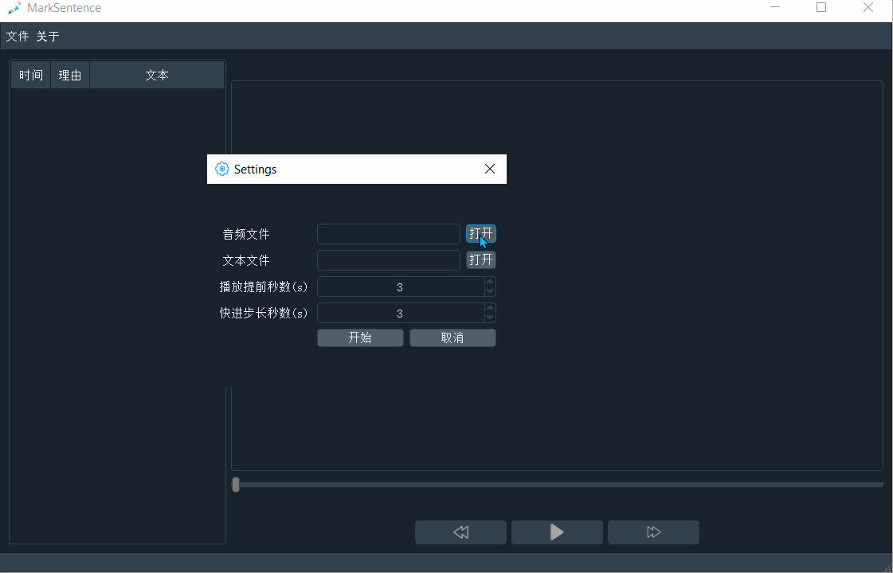
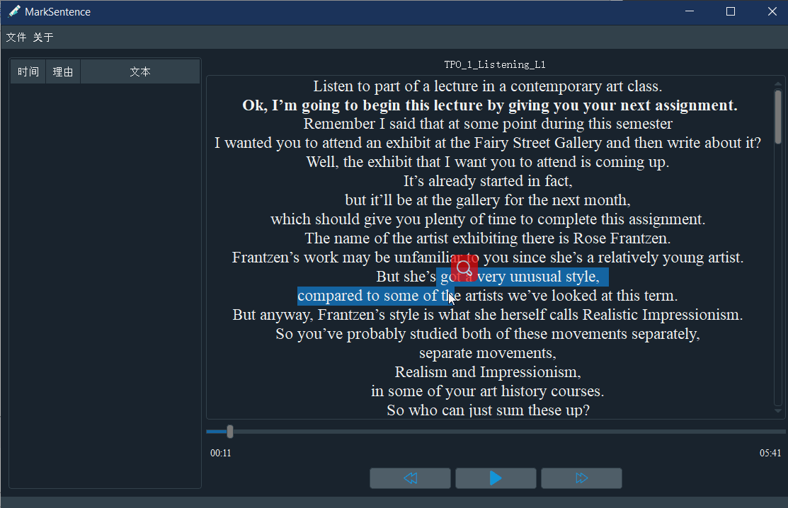

# MarkSentence 

一个在可以文本对照的听力句子的标记工具，即精听工具，目前专门针对于`TOEFL`
对`TPO1-54`的听力做标记，方便复习(支持`listening`部分的文本显示)

## 使用

### 下载安装包
- [marksentence v1.2](https://github.com/Gltina/marksentence/releases/download/V1.2/marksentence.exe)

### 从源码编译
- Qt 5.12.3 (based on MSVC2017 64bit)

### 使用TPO1-TPO54的资源
- 从[这里](https://pan.baidu.com/s/1wlWVfvdSkorc04DWji6-uA)下载，建议阅读`readme.txt`

###  目录结构 
这些是程序运行的时自动生成的目录
- `Json/*.json`:保存你的标签内容
- `Log/log`:操作日志
- `Lyric/*.txt`:与`TPO`音频对应的文本文件 [建议存放所有文本文件]
- `TPO/TPO[1-54]/*.mp3`:下载的`TPO`音频文件

## 案例




## Project status
更多请查看[项目日志](log/README.md) 

## Q&A
- 有些听力播放不了？:worried:
	- 可以尝试下载[LAVFilters](https://github.com/Nevcairiel/LAVFilters/releases/download/0.74.1/LAVFilters-0.74.1-Installer.exe)，再添加`LAV Filters\x86`至环境变量。我已意识到了这个问题:smirk:，会在程序中添加相关的`dll`的，如果你还是遇到了这个问题，请联系我:fries:
- 在`Linux(Ubuntu)`下编译遇到了 `[error] your Gstreamer installation is missing a plug-in` 错误
- 输入
``` bash
sudo apt-get update
sudo apt-get install clementine
```

## Contribute
如果想了解项目中的小细节，可以查看[sparkSpot](./log/sparkSpot.md)

关于英语精听有什么方法，如何有计划的复习英语的听力... 所有的这些问题欢迎讨论

## Support
`ptsph\*foxmail.com(*->@) `

## Thanks 
[QDarkStyleSheet](https://github.com/ColinDuquesnoy/QDarkStyleSheet)

[iconfont](https://www.iconfont.cn/home/index)

[威学托福](http://t.weixue100.com/toefl)

[小站托福](http://toefl.zhan.com/)

## License
[GNU GPL3.0](https://github.com/Gltina/MarkSencent/blob/master/LICENSE)