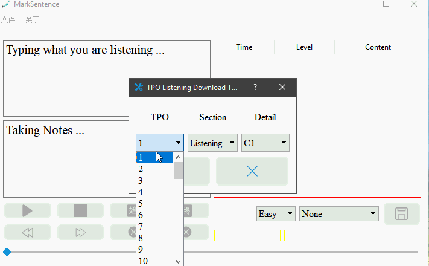
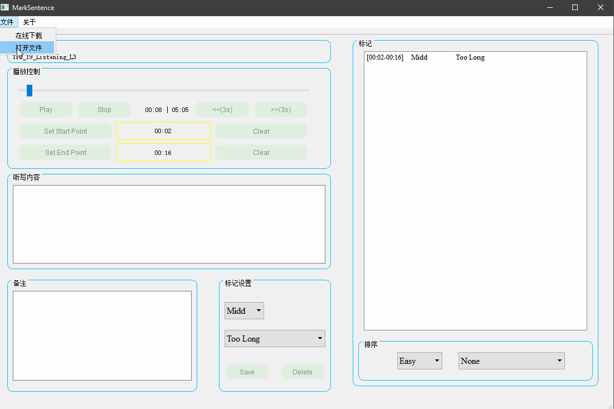
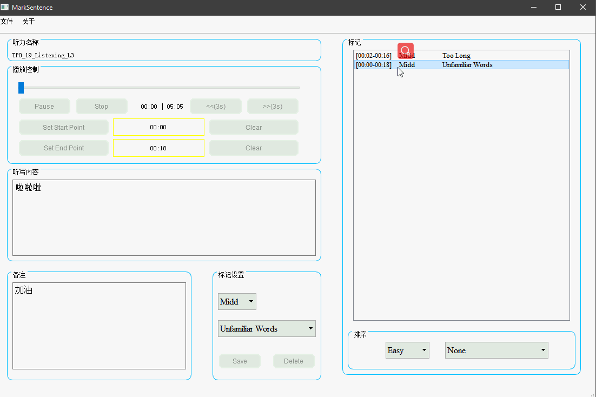

Special for TOEFL
-------------------------------------------------------------------------------
这是一个在听力中标记句子的工具(**即精听工具**)，使用`QT5.9.0+Qt Creator 4.3.0`开发

功能
-------------------------------------------------------------------------------
- 可以下载TPO1-54的所有听力(包括**口语**和**写作**部分)
- 对音频截断，并且做上标记
- 所做的标签都可以保存下载，在下次听的时候还会载入

下载地址
-------------------------------------------------------------------------------
解压后双击 `"MarkSentence v.1.0.exe"` 即可

[点我下载](http://39.97.115.128:8000/SHATOEFL/MarkSentence.zip)

快捷键
-------------------------------------------------------------------------------
|作用|	对应按键|
| ------ | ------ |
|快进后退	|方向键左右|
|设置左右断点|	"[" 和 "]"|
|取消左右断点|	shift+"[" 和 "]"|
|保存当前段	|回车Enter|

样例 & 如何使用
--------------------------------------------------------------------------------
- 你可以下载你想听的听力（**包括TPO1-54所有**有听力的部分） `C++ 由于太穷，只买了2M的带宽`

	- 

- 开始精听

	- 

	- 

开发日志
--------------------------------------------------------------------------------
- 2019年4月21日 
	- **想法诞生**
- 2019年4月22日 
	- 尝试使用`python`的`tkinter`开发
	- 找不到较好的音频播放控制库
	- 开始考虑逐渐转向`QT`
- 2019年4月23日 
	- 尝试使用`QT5.5+`开发
	- 收集资料快速搭建原型
- 2019年4月24日 
	- `fix bugs`
- 2019年4月25日
	- `fix bugs`
	- 添加了在线获取TPO50-54的功能
- 2019年4月26日
	- `fix bugs`
	- 搭建阿里云用于获取/存储TPO
	- 现在支持`TPO1-54`了
- 2019年4月27日
	- `fix bugs`
	- 调整了一些界面，今天使用了一天，感觉，嗯还不错
	- **程序进入"稳定"阶段**，今后的每次`commit`都是`fix bug`

从想法诞生的那天起，就计划只花费大概5天时间来完成，后来拖到了大概7天，中间也走了一点弯路，还好快速拐回来了，还有很多有意思的功能没有添加，比如设计图标/自定义语速/输入框的字体/买个好点的服务器/界面更好看一点...以后有时间了再做吧。 

听说你想请我喝雪冰
--------------------------------------------------------------------------------

