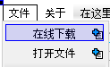
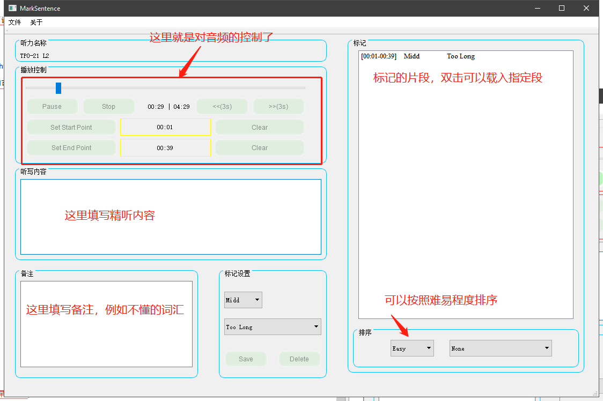

# MarkSencent
### Special for TOEFL

这是一个在听力中标记句子的工具(**精听工具**)，对一段听力音频中的任意段进行截取，并且标记，标记内容包括难易程度，没听出来的原因(**例如生词，语法，长句等**)。接着，你可以对标记完后的句子进行筛选，选出那些你标记**难\简\中**句子，或者选出语法错误的句子，选择后你可以对这些句子进行专门听写。 目前还处在**开发阶段**，而且是**初期**。

- 理想功能：
	- 截断听
	- 所截取段可以循环听
	- 保存截取段，并标记没听出来的原因
	- 每个听力都有对应的标记文件，其包含了许多标记的句子
---
 
# 下载地址(百度云盘)

[点我进入下载界面（百度云提取码 6qjj ）](https://pan.baidu.com/s/17GPSgcjjJYMYi2c1kRFiag)

> 解压后双击 "MarkSentence v0.2.exe" 即可

# 快捷键

|作用|	对应按键|
| ------ | ------ |
|快进后退	|方向键左右|
|设置左右断点|	"[" 和 "]"|
|取消左右断点|	shift+"[" 和 "]"|
|保存当前段	|回车Enter|

# 样例 & 如何使用

现在可以**在线下载一个音频文件**了

# 开发日志
- 2019年4月21日 
	- 想法诞生
- 2019年4月22日 
	- 尝试使用python原生tkinter开发
	- 找不到较好的音频播放控制库
	- 开始逐渐转向QT
- 2019年4月23日 
	- 尝试使用QT5.5+开发
	- 收集资料快速搭建原型
- 2019年4月24日 
	- 完善必要功能
- 2019年4月25日
	- 完善
	- 添加了在线获取TPO50-54的功能
	
# 赞助（我还能说啥子，太感谢你啦5555 祝你早日杀托）

