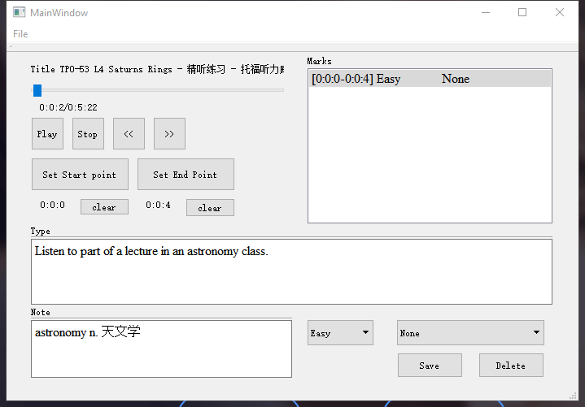
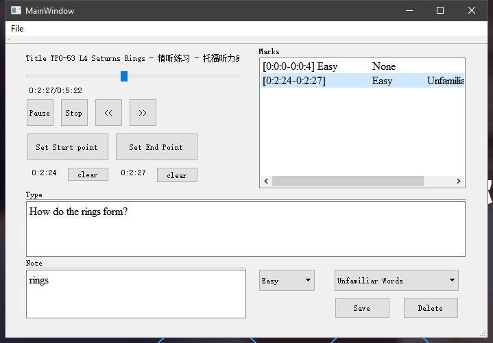

# MarkSencent
### Special for TOEFL

这是一个在听力中标记句子的工具(**精听工具**)，对一段听力音频中的任意段进行截取，并且标记，标记内容包括难易程度，没听出来的原因(**例如生词，语法，长句等**)。接着，你可以对标记完后的句子进行筛选，选出那些你标记**难\简\中**句子，或者选出语法错误的句子，选择后你可以对这些句子进行专门听写。 目前还处在**开发阶段**，而且是**初期**。

- 理想功能：
	- 截断听
	- 所截取段可以循环听
	- 保存截取段，并标记没听出来的原因
	- 每个听力都有对应的标记文件，其包含了许多标记的句子
	
---
| 进度 | 内容 | 
| ------ | ------ |
| 完成 | 对音频进行分段 |
| 完成 | *单次可使用 | 
| 正在 | marks保存与载入 |  
| 正在 | mark的排序 |
| 不在计划 | 界面调整 |
| 不在计划 | 可扩展优化 |

> *因不具备保存功能，关闭软件后就gg

# 案例

